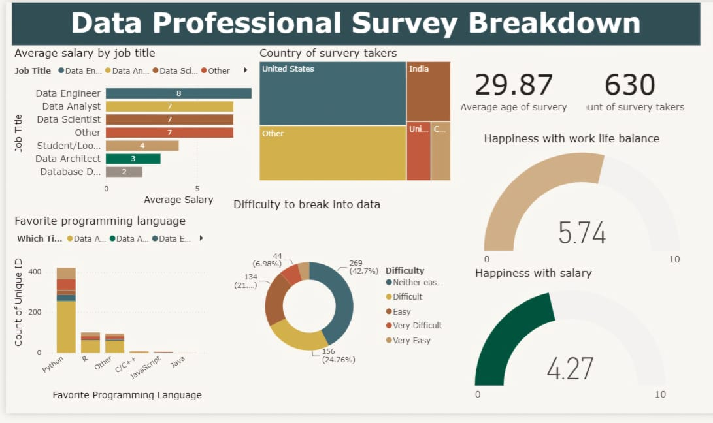

# Data Professional Survey Dashboard

## 📊 Overview
This project showcases a Power BI dashboard created to analyze survey data from data professionals across the globe. The report visualizes key metrics regarding job titles, salaries, favorite programming languages, and overall career satisfaction.

## 🛠️ Tools Used
- **Power BI:** For data visualization and dashboard creation.
- **Power Query:** For cleaning and transforming the raw data.
- **Excel:** For initial storage and structuring of the raw survey dataset.

## 📈 Key Insights
- **Demographics:** A total of **630** survey takers were recorded, with an average age of **29.87**.
- **Salary Trends:** **Data Engineers** report the highest average salaries among the surveyed professionals, followed closely by Data Scientists.
- **Work-Life Balance:** The average happiness score regarding work-life balance is **5.74/10**.
- **Salary Satisfaction:** The average happiness score with current salary is **4.27/10**, suggesting a gap between compensation and satisfaction.
- **Programming Languages:** **Python** is overwhelmingly the most popular programming language among data professionals.
- **Career Break-in:** The majority of participants (approx. 42%) found the difficulty of breaking into the data field to be "Neither easy nor difficult".

## 📂 Files Included
- `dashboard.pbix` - The Power BI dashboard file.
- `Data Cleaning Start.xlsx` - The raw Excel data used for the analysis.
- `dashboard.jpeg` - Screenshot of the final dashboard.

## 🚀 How to use
1. Download the `Data Cleaning Start.xlsx` and `dashboard.pbix` files.
2. Open `dashboard.pbix` in Power BI Desktop.
3. *Note: You may need to update the Data Source path in Power BI by going to Transform Data > Data Source Settings and pointing it to your local `Data Cleaning Start.xlsx` file.*
